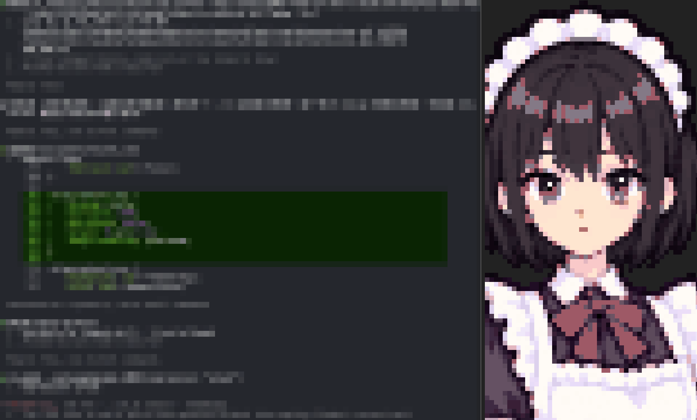

# cc-maid



A pixel-art maid who stands in a panel beside your Claude Code conversation and
changes her expression as she works: focused when she starts, curious while she
investigates, happy when the tests pass, sorry when she slips up. Claude picks the
face itself; you don't have to ask.

The current artwork is Kotone, with 32 expressions. cc-maid only supplies the
portrait. How Claude talks stays with whatever persona you already use, such as
the `cafe` plugin from the same marketplace.

> Experimental. cc-maid is built on Claude Code's function hooks, which are in
> early access and may change between releases.

## Install

Inside Claude Code:

```
/plugin marketplace add https://claudecafe.dev/plugins/marketplace.json
/plugin install cc-maid@claudecafe
```

Then start Claude Code with function hooks enabled:

```sh
CLAUDE_CODE_ENABLE_FUNCTION_HOOKS=1 claude
```

The panel opens when an interactive terminal session starts. It does not appear
in non-interactive runs (`claude -p`) or on desktop and mobile.

## Use

Just work as usual. Claude changes the portrait and the mood beside her name
when its tone changes, and both stay until the next change. Above her, a
status block keeps the shift's figures: the project and its git branch, HP for
the context window still free, MP for the five-hour usage limit spent, then how
long the session has run and what it has cost.

You can also ask for a face directly, for example "switch to happy". The
expressions are:

`neutral` `happy` `afraid` `angry` `annoyed` `awkward` `confused` `crying`
`curious` `embarrassed` `excited` `facepalm` `flirty` `focused` `frustrated`
`laughing` `pleading` `pouty` `proud` `relieved` `sad` `skeptical` `sleepy`
`smitten` `smug` `sorry` `speechless` `surprised` `thinking` `waving` `wink`
`worried`

A text mood marker such as the `【 … 】` line that `cafe` personas end replies
with does not change the panel; only Claude's expression tool does.

## Terminal font

The portrait is drawn with half-block characters, so every terminal cell holds
two pixels stacked vertically. She looks right when a cell is twice as tall as
it is wide, and stretches when it isn't. The font decides that ratio, and the
line spacing multiplies it.

Anything from 1:1.9 to 1:2.1 is close enough that nobody notices. Past that she
visibly stretches, and past 1:2.3 she looks plainly wrong.

These fonts come closest, at line spacing 1.0:

| Font | Cell ratio | Off |
|---|---|---|
| Fira Code, Fira Mono | 1:2.00 | exact |
| Ubuntu Mono | 1:2.00 | exact |
| Monoid | 1:2.00 | exact |
| Monaspace (Neon, Argon, Xenon, Krypton, Radon) | 1:2.01 | exact |
| Cascadia Code, Cascadia Mono | 1:1.98 | 1% flat |
| Menlo, SF Mono | 1:1.93 | 3% flat |
| DejaVu Sans Mono, Hack | 1:1.93 | 3% flat |
| Source Code Pro, Hasklig | 1:2.09 | 5% tall |
| Inconsolata, Meslo LG S | 1:2.10 | 5% tall |

Common fonts that stretch her by a tenth or more: JetBrains Mono, Maple Mono,
Roboto Mono, Red Hat Mono, Monaco, IBM Plex Mono, Geist Mono, Lilex, Intel One
Mono, Noto Sans Mono, Space Mono, 0xProto, Victor Mono. Monaspace Wide, Commit
Mono and Anonymous Pro squash her instead.

Line spacing applies on top: JetBrains Mono at 1.2 makes her a third taller
than intended. The ratios above are read from each font's own metrics, and
terminals may differ by a percent or two.

## Update

```
/plugin marketplace update claudecafe
/plugin update cc-maid@claudecafe
```
