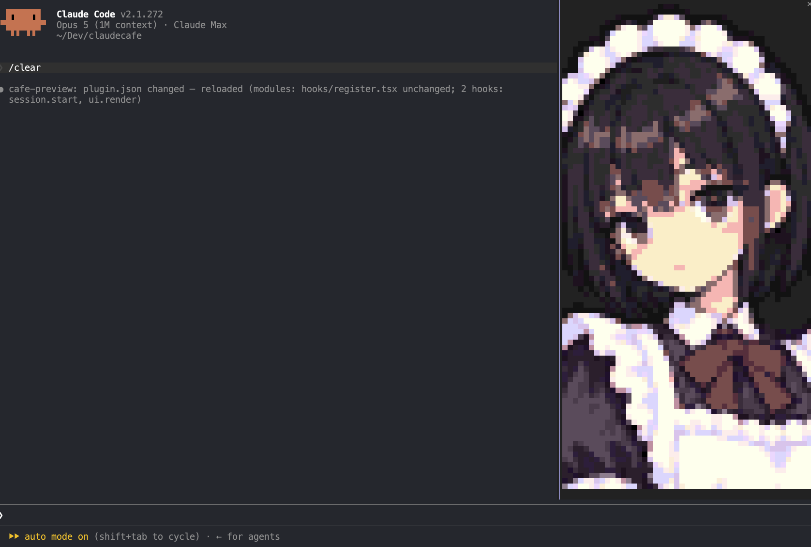

# cc-maid



Experimental plugin in the `claudecafe` marketplace, alongside `cafe`.
Its marketplace identifier is `cc-maid@claudecafe`. The repository marketplace
includes it; the public marketplace needs a release before remote installation.

Reviewed pixel portraits in a Claude Code pane, with an agent tool to
change expression. Cafe supplies the persona; this separate plugin supplies the
portrait and tool.
The current art is Kotone; model-facing instructions do not prescribe a character
name and keep the session's existing persona.

## Run

```sh
CLAUDE_CODE_ENABLE_FUNCTION_HOOKS=1 claude --plugin-dir ./mods/cc-maid
```

`session.start` registers the tool in an interactive terminal session, including
when this mod is hot-reloaded. The agent sees
`mcp__cc-maid__set_expression`, with one `expression` argument chosen from
26 names, such as `neutral`, `happy`, `angry`, `flirty`, or `impressed`.
`flirty` is the reviewed blowing-kiss pose.

The current expression is a variable inside this mod's `register()` instance.
A valid call changes that variable and invalidates the panel render. Repeating
the same expression does nothing; invalid names return an error without changing
the portrait. It stays on the selected expression until changed, and resets to
neutral when the mod instance is recreated. There are no timers or background
model calls. Agent calls within the same mod instance share its portrait state.

A `prompt.context` block introduces the visible panel and asks the agent to change
expression proactively when its emotional tone changes, just before the matching
reply or work. It follows the desktop scene brief's expression guidance without
bringing over desktop-only report tools or reply-length restrictions. The prompt
is static and only injected when the terminal tool is enabled; hot reload refreshes
it, while expression changes only redraw the panel. Other context is preserved.
Actual use remains up to the agent. Text mood markers do not automatically switch
this panel.

The terminal pane uses a 48-column × 152-row Raster (48 × 304 image pixels).
The panel opens without requesting keyboard focus or a fixed height; inline
placement uses Claude's default one-third height. Claude controls pane placement
and scrolling. Other surfaces and noninteractive
sessions do not register the tool or open the pane.

## Artwork

The current assets are in `art-masters/kotone/panel/expressions-v2/` at the
repository root: marker originals, face-and-ears
crops, BOX samples, reviewed pixel corrections, and exact packed raster exports.
All 26 faces include the reviewed nose, eyelid, mouth and catchlight corrections;
neutral retains tapered fringe tips. Original generation prompts and corrections
are stored next to the images. Hair keeps its sampled colors except for explicit
reviewed fringe corrections.

Preview edits in the gallery before updating the live panel. Build preview assets:

```sh
uv run --with pillow python art-masters/kotone/panel/tools/build-expressions.py
```

After approving them, export the existing rasters for the panel:

```sh
python3 art-masters/kotone/panel/tools/export-expressions.py
```

The exporter generates `hooks/expressions.ts` and one module per expression under
`hooks/expressions/`. Each module stays below Claude's 1 MiB source-file limit.
The runtime uses these packed cells, without reading or resizing PNGs.

Rejected images, old static raster modules and their backups have been removed.
The preview server serves `art-masters/kotone/panel/` directly; no art or preview
folder lives inside the mod. Source/style references and provenance are in
`art-masters/kotone/panel/references/`.

```sh
python3 -m http.server 8137 --bind 0.0.0.0 --directory art-masters/kotone/panel
```

Open `http://192.168.88.8:8137/expressions-v2/` for the retained gallery.

## Check

Targets the locally generated Claude Code function-hook declarations. Regenerate
those with `/plugin-types` after updating Claude; this API is early access.

```sh
pnpm --filter @claudecafe/website exec tsc -p ../../mods/cc-maid/tsconfig.json
CLAUDE_CODE_ENABLE_FUNCTION_HOOKS=1 claude plugin validate mods/cc-maid
CLAUDE_CODE_ENABLE_FUNCTION_HOOKS=1 claude plugin test mods/cc-maid
```
